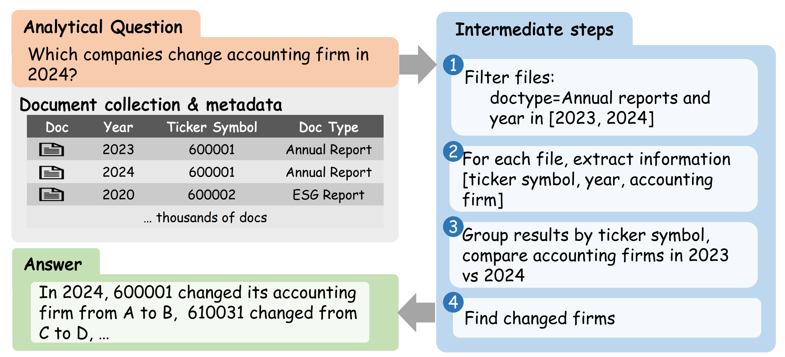

<div align="center">

# MuDABench

**A benchmark for large-scale multi-document analytical question answering**

[](https://2026.aclweb.org/)
[](https://huggingface.co/datasets/Zhanli-Li/MuDABench)
[](./LICENSE)
[](https://github.com/Zhanli-Li/MuDABench/stargazers)
[](https://github.com/Zhanli-Li/MuDABench/network/members)

</div>

<p align="center">
  
</p>

## Overview

**MuDABench** is a benchmark for **multi-document analytical question answering** over large-scale document collections.

The benchmark focuses on analytical QA over **Chinese A-share market documents**, where each question requires aggregating and reasoning over information from **multiple financial documents**, rather than extracting an answer from a single source.

MuDABench is designed to evaluate systems that combine:

- multi-document retrieval
- long-context evidence aggregation
- structured financial information understanding
- analytical reasoning over heterogeneous documents
- concise and detailed answer generation

## Dataset

The public release contains:

| File / Directory | Description |
|---|---|
| `data/simple.json` | 166 QA samples with concise final answers |
| `data/complex.json` | 166 QA samples with more detailed analytical final answers |
| `data/pdf/` | 589 source PDF files referenced by the QA samples |

Each QA sample is paired with document-level structured evidence and reference answers.

## Hugging Face Dataset

The dataset is available on Hugging Face:

[https://huggingface.co/datasets/Zhanli-Li/MuDABench](https://huggingface.co/datasets/Zhanli-Li/MuDABench)

## Data Format

Each item in `data/simple.json` or `data/complex.json` is a multi-document analytical QA sample.

```json
{
  "question": "...",
  "metadata": [
    {
      "id": "uuid-used-as-pdf-filename",
      "symbol": "company ticker",
      "year": 2021,
      "doctype": "document type",
      "schema": {
        "value_xxx": "field meaning"
      },
      "value_xxx": "structured value"
    }
  ],
  "source_answer": "intermediate supporting facts (text)",
  "final_answer": "reference final answer"
}
````

### Field Description

| Field                | Description                                                          |
| -------------------- | -------------------------------------------------------------------- |
| `question`           | The analytical question to be answered                               |
| `metadata`           | Document-level structured evidence used by the question              |
| `metadata[].id`      | UUID that matches the corresponding PDF filename stem in `data/pdf/` |
| `metadata[].symbol`  | Company ticker / stock symbol                                        |
| `metadata[].year`    | Document year                                                        |
| `metadata[].doctype` | Type of the referenced document                                      |
| `metadata[].schema`  | Semantics of the structured `value_*` fields                         |
| `source_answer`      | Intermediate supporting facts                                        |
| `final_answer`       | Reference final answer                                               |

> Note: Different questions may use different subsets of `value_*` fields.
> The public release does not include `openai_vectors_id`.

## File Structure

```text
MuDABench/
├── data/
│   ├── simple.json
│   ├── complex.json
│   └── pdf/
├── fig/
│   └── case.png
├── LICENSE
└── README.md
```

## Intended Use

MuDABench can be used for:

* evaluating multi-document analytical QA systems
* benchmarking retrieval-augmented generation pipelines
* testing long-context reasoning over financial documents
* studying Chinese financial document understanding
* comparing concise-answer and complex-answer QA performance

## Example Use Cases

MuDABench is suitable for evaluating whether a system can:

1. retrieve relevant documents from a large PDF collection;
2. identify structured evidence across multiple companies, years, or document types;
3. aggregate scattered financial facts;
4. perform analytical comparison or reasoning;
5. generate faithful final answers grounded in the evidence.

## Repository Links

* GitHub: [https://github.com/Zhanli-Li/MuDABench](https://github.com/Zhanli-Li/MuDABench)
* Hugging Face: [https://huggingface.co/datasets/Zhanli-Li/MuDABench](https://huggingface.co/datasets/Zhanli-Li/MuDABench)

## Citation

If you find MuDABench useful for your research, please consider citing this work.

```bibtex
@misc{mudabench2026,
  title        = {MuDABench: A Benchmark for Large-Scale Multi-Document Analysis},
  author       = {Li, Zhanli and others},
  year         = {2026},
  note         = {ACL 2026},
  howpublished = {\url{https://github.com/Zhanli-Li/MuDABench}}
}
```

## License

MuDABench is released under the **Apache License 2.0**.
See [LICENSE](./LICENSE) for more details.

